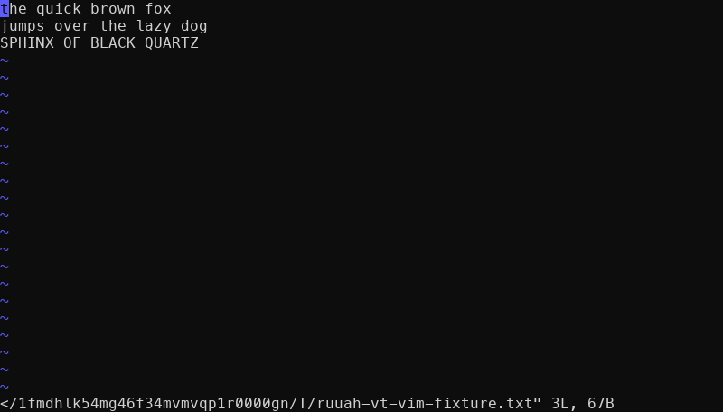
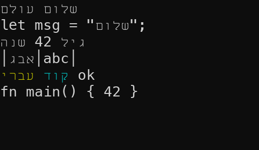
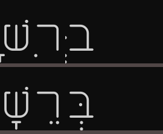
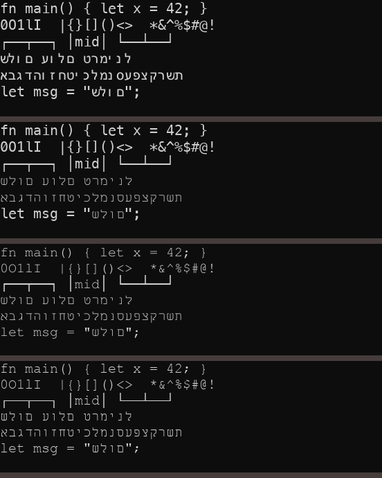
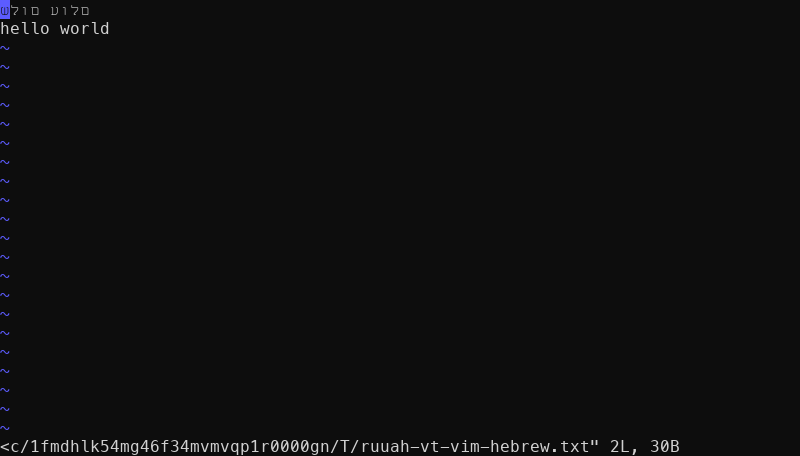

# ruuah-vt

A terminal core in Rust that implements the C ABI Ghostty already publishes as **`libghostty-vt`**,
so it can drop in behind an existing native GUI on one link flag.

The point is control and craft, not speed. Rust and Zig are peers here and there is no
performance win waiting; what a from-scratch core buys is a place to put things the upstream
ABI has no surface for. Chiefly: **Hebrew, end to end, done properly.**



That is real vim, on a real pty, rendered by this repo's own rasterizer in a headless test.

## Why this exists

Ghostty's VT core is excellent and its C ABI is public. Reimplementing it is only worth doing
if you can prove you match it, so the project is built the other way round from usual: the
**differential oracle harness came first**, in slice 0, before a single line of terminal logic.
Every slice since is measured against the real library rather than against an opinion of what
terminals do.

The consumer is **RUUAH**, a Ghostty fork whose Swift app links `libghostty-vt` today. If
ruuah-vt wins, RUUAH swaps one link flag.

## The one architectural rule

**The core is a pure, deterministic state machine.** Bytes in, grid mutations out. No PTY, no
GPU, no clock, no I/O.

Everything else hangs off that, because it is what makes headless CI and differential testing
possible at all. Ghostty enforces the same split physically between `src/terminal/` and
`src/renderer/`. I/O lives in exactly one crate, and it is not the core.

## Status

| Slice | What | Tag |
|---|---|---|
| 0 | Differential oracle harness against the real `libghostty-vt` | `v0.0.0` |
| 1 | `vte` parser wired to a flat row-major cell grid, full SGR | `v0.1.0` |
| 2 | Screen semantics: autowrap phantom state, scroll regions, alt screen, tabs, erase family | `v0.2.0` |
| 3 | Paged scrollback with an exact row budget | `v0.3.0` |
| 4 | Reflow on resize, including scrollback and cursor mapping | `v0.4.0` |
| 5 | Damage tracking, frame channel, pty host, and a renderer that draws vim | `v0.5.0` |
| 5.5a | Display bidi: Hebrew reorders, measured against the Unicode conformance suite | - |
| 5.5b | Shaping: niqqud placed by the font's GPOS table, not by default bearings | - |

**195 tests green.** Corpus: 78 cases, 71 match / 7 diff, 78/78 met expectation.

Hebrew is now correct end to end: reordered by the Unicode algorithm and pointed by the font.





Above: shaping off, then on. The marks move from the cell's left edge to where the font's GPOS
table actually puts them.

## How correctness is established

Three mechanisms, in order of how much work they do.

**1. The differential corpus.** `corpus/cases.toml` holds byte streams. Each is fed to both
this core and the real `libghostty-vt`, and the resulting grids are compared cell by cell.
A case declares the verdict it expects:

```
78 cases: 71 match, 7 diff. 78/78 met expectation.
Harness verdict: WORKING - agreement and disagreement both detected.
```

The seven `diff` cases are deliberate, named omissions. They are not failures, they are the
proof that the harness can still tell things apart - a corpus where nothing ever differs
cannot demonstrate that it detects disagreement. When a behaviour gets implemented, its case
*fails*, and gets promoted to `match`. A harness that cannot be wrong is not evidence.

**2. Extend the harness before the slice. Seven for seven.** Every single slice has had a blind
spot that would have reported success for a wrong implementation, and each was found by asking
"can the harness even see this?" *before* writing code. Twice in slice 5 the blind spot was
total: nothing could observe a concurrency bug, and later, nothing could observe a pixel. The
bidi suite kept the streak going - it caught a real bug on its first run, a fast path that
skipped the algorithm for plain text without accounting for the base direction.

**3. Prove the harness can fail.** Both slice 5 harnesses ship a deliberately broken control
alongside the real one. `read_into_unsynchronized_for_testing` reads frames with the seqlock
protocol removed and *must* observe tearing; `draw_skipping_for_testing` declines to repaint
one damaged row and *must* produce different pixels. If a control ever goes quiet, the test it
guards has stopped being evidence.

## Layout

```
crates/snapshot/   what "the grid" means for comparison - the contract both
                   implementations satisfy, owned by neither
crates/ghostty/    bindings to the real libghostty-vt, pinned against the
                   library's own ghostty_type_json() ABI description
crates/core/       the terminal itself: parser, grid, screens, scrollback, reflow.
                   Pure. No I/O.
crates/difftest/   runs the corpus and reports
crates/frame/      publishes a whole frame from the parse thread to a renderer
                   through a seqlock
crates/pty/        the pseudoterminal and the child process. The only I/O in the
                   project, and the only unsafe block.
crates/render/     font stack, glyph atlas, xterm palette, damage-driven CPU
                   compositor
```

One-way dependencies. `core` knows nothing about `frame`; `frame` knows nothing about `pty`.

## Threading

The parse thread owns the `Terminal` outright and never shares it. The renderer receives
**published frames** through a seqlock: a generation counter that is odd while a publish is in
flight, so a reader arriving mid-write discards that frame rather than drawing half of one.

Ghostty reached for a mutex here and then had to add a demand-and-handoff protocol on top of
it, because under sustained pty output an unfair mutex lets the parse loop relock before a
sleeping renderer can be scheduled. The seqlock sidesteps that fairness question and buys a
different trade: a busy writer can make a reader skip a frame, and the caller decides when to
come back.

There is **no `unsafe`** in the seqlock and no volatile trickery. The payload is `AtomicU64`
accessed `Relaxed`, which is defined under racing access because Rust defines a data race as
requiring a *non-atomic* access; the counter's `Acquire`/`Release` pair supplies the
consistency that turns a set of atomic words into one coherent frame.

Rows carry a generation **stamp** rather than a dirty flag, because a reader is allowed to miss
frames and a flag cleared at publish time cannot express "changed in one of the six frames you
did not read".

## Hebrew

The reason the project exists, and the part that is deliberately unfinished.

**Where bidi lives: the renderer, never the core.** `libghostty-vt`'s headers have zero bidi
surface, so reordering inside the core would break the drop-in compatibility that is the whole
thesis, and would make every RTL line diverge from the oracle *by construction* - deleting the
only correctness signal there is. Ghostty's own bidi-adjacent code sits in the font shaper too.

So the renderer's only input is **runs**, and a `Run` carries a `Direction` plus `column_of`.
That seam is what made slice 5.5 cheap: turning reordering on changed the run builder and
`bidi.rs`, and **not one line of drawing code**. A renderer that had added an index to a run's
start instead would have compiled, passed every test before 5.5, and drawn Hebrew backwards
after it.

**Reordering is measured, not eyeballed.** `crates/frame/tests/bidi_conformance.rs` runs all
91,707 `BidiCharacterTest` cases through the real `visual_spans` path; `./scripts/fetch-ucd.sh`
vendors the suite and `ucd.lock` pins the Unicode revision. The algorithm underneath is
`wezterm-bidi`, chosen by running it over the whole suite rather than by reputation:
770,241/770,241 and 91,707/91,707 on levels and visual order, and it takes `&[char]` and
returns contiguous level runs, which is why a `Run` stayed a plain slice.

Two policies sit on top of the UBA, and Unicode has no opinion about either, so both are
unit-tested separately:

- **The base direction is LTR**, not auto. A grid is column-addressed by the program drawing
  into it, so auto-detection would move a Hebrew status line written at column 0 to the right
  edge. RTL runs still reorder within their own span.
- **Segments are bounded by box drawing** (U+2500..=U+259F). Whole-line UBA across a table
  moves the frame characters relative to the text they enclose.

What that produces, through the real terminal path:

| logical | visual |
|---|---|
| `שלום עולם` | `םלוע םולש` (reads right to left, word order kept) |
| `let msg = "שלום";` | `let msg = "םולש";` (code stays put) |
| `גיל 42 שנה` | `הנש 42 ליג` (the number stays `42`, not `24`) |
| `│אבג│abc│` | `│גבא│abc│` (bars stay in columns 0, 4, 8) |

**Fonts.** No single font can draw this terminal. Measured across every font on the machine:
Menlo maps Hebrew to glyph 0, and Arial Hebrew maps `A` to glyph 0. So fallback is required
rather than an enhancement, and the atlas keys on **(font, glyph)** - a glyph id without its
font is meaningless.

The Hebrew face is **Miriam Mono CLM** (Culmus project, GPL v2). Verified by shaping: it
composes shin+shin-dot and bet+dagesh into single glyphs via GSUB, positions a qamats via GPOS
at exactly half the advance so the mark is centred under its base, gives marks zero advance so
a pointed cluster stays *one cell*, and advances Latin and Hebrew identically at 0.6em - the
same advance as Menlo, so the two share a grid with no seam. It cannot lead the stack, though:
it covers 0 of 128 box-drawing codepoints.



Hebrew reaching pixels today, still in logical order:



That ordering is pinned by a pixel-level test which slice 5.5 must deliberately flip.

**Shaping.** Each cell's cluster goes through swash, so combining marks are placed by the
font's GPOS table. Only clusters with more than one codepoint pay for it. One cell is shaped at
a time on purpose: a terminal cell is addressable, and shaping across cells would let the
renderer merge or re-space cells the program placed deliberately. The cost is that Arabic
contextual joining does not cross cells, which every terminal shares.

**What is honestly still missing:** input bidi - a visual caret and visual-order arrow keys
inside a shell's own prompt (slice 5.6). The caret inside a third-party TUI's editing buffer
(vim insert mode) is not solvable at this layer at all, because the application owns that
buffer.

## Building

Requires the oracle, which is built from a Ghostty checkout. Zig must be exactly `0.16.0`.

```sh
./scripts/build-oracle.sh            # the core's oracle: libghostty-vt into vendor/
./scripts/fetch-ucd.sh               # the reordering oracle: the Unicode bidi suite
cargo test --workspace               # the gate
cargo run -p ruuah-vt-difftest       # the corpus report
cargo run -p ruuah-vt-difftest -- --dump   # plus both grids, rendered, per case
```

`RUUAH_VT_ORACLE_SRC` points at the Ghostty checkout to build from (defaults to `../ruuah`).
`RUUAH_VT_ORACLE_PREFIX` uses a prebuilt prefix instead.

The oracle build never writes to the Ghostty checkout: it redirects both `--prefix` and
`--cache-dir`, then verifies the checkout is still clean and fails if it is not.

`oracle.lock` pins the exact Ghostty commit the current oracle was built from. Without it, a
corpus verdict flipping overnight is indistinguishable from a regression you caused.

## Dependencies

Deliberately few: `vte`, `unicode-width`, `thiserror`, `serde`, `toml`, `rustix`, `swash`,
`wezterm-bidi`.

`portable-pty` was evaluated for the pty host and rejected - on macOS it costs thirteen crates
including a serial-port library and a second `thiserror` major version. `rustix` costs three,
and the pty dance is about sixty lines with one justified `unsafe` block.

## Notes

Private, unlicensed, no contributions expected. Engineering conventions and the full record of
measured gotchas live in `CLAUDE.md`.
