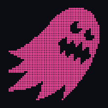
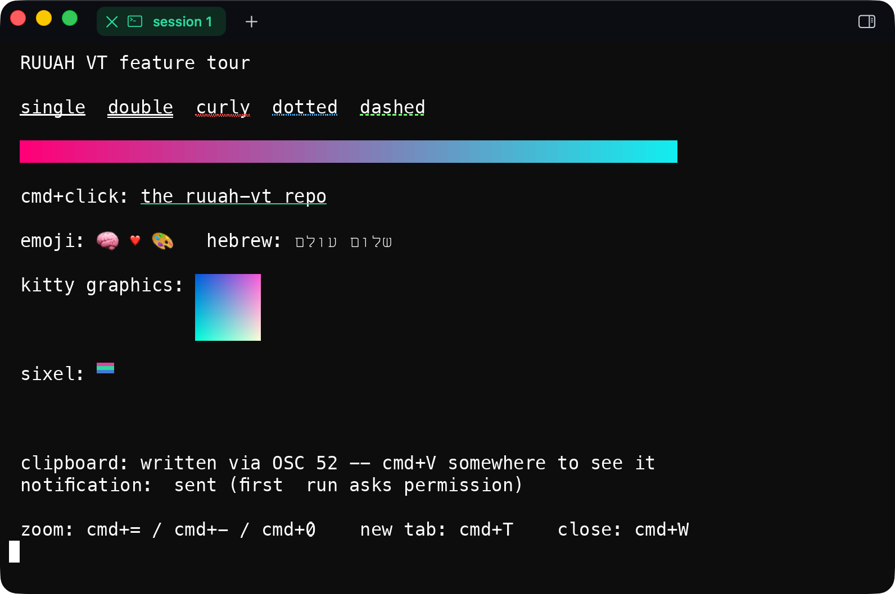

<p align="center">
  
</p>

<h1 align="center">RUUAH VT</h1>

<p align="center">
  A terminal core in Rust, gated on a differential oracle — and the macOS terminal built on top of it.
</p>

---

RUUAH VT is two things in one repository:

1. **A VT core** (`crates/`) implementing the C ABI Ghostty publishes as
   **`libghostty-vt`**, so anything built against that ABI can link either library. The
   core is a pure, deterministic state machine — bytes in, grid mutations out. No PTY,
   no GPU, no clock, no I/O.
2. **A native macOS terminal** (`swift/`, `RUUAH VT.app`) — Hebrew-first, GPU-rendered,
   built for daily work.



## Why this exists

Ghostty's VT core is excellent and its C ABI is public. Reimplementing it is only worth
doing if you can prove you match it, so the project is built the other way round from
usual: the **differential oracle harness came first**, before a single line of terminal
logic. Every slice since is measured against the real library rather than against an
opinion of what terminals do — including the corpus verdicts that must *disagree*,
because a harness that cannot detect disagreement proves nothing. The CPU and GPU
renderers are bit-identical by specification, not merely close.

And the reason to want a from-scratch core at all: a place to put things the upstream
ABI has no surface for. Chiefly — **Hebrew, end to end, done properly.**

## Features

**Terminal core**
- Full VT parsing on a vendored [vte](https://github.com/alacritty/vte) (one addition: APC dispatch)
- True color; styled underlines — single/double/curly/dotted/dashed, SGR 58 underline color
- OSC 8 hyperlinks; the stamps survive scroll and resize
- OSC 52 clipboard write · OSC 9 / OSC 777 notifications · bell
- DSR / DA query replies through the pty (programs that probe get real answers)
- Bracketed paste (mode 2004) with the oracle-measured encoding
- **Kitty graphics protocol** — direct transmission, RGB/RGBA/PNG, chunked, queries answered
- **Sixel**, decoded into the same image pipeline
- Grapheme clusters from day one; wide glyphs and spacer tails; VS16 emoji presentation
- Paged scrollback with an exact row budget

**Rendering**
- Glyph atlas, damage-driven redraw; a CPU reference backend and a wgpu compute backend,
  byte-equal to each other
- Color emoji (sbix), synthesized block mosaics, per-glyph font fallback measured on this machine
- **Bidi done right**: UBA reordering in the renderer (91,707/91,707 BidiCharacterTest),
  mirrored brackets in RTL runs, niqqud placed by GPOS shaping — and never in the core,
  where reordering would break cursor addressing
- Font ligatures behind a substitution guard: a non-ligating font renders byte-identically
  with the feature on or off

**The app**
- Top tab bar and session management; cmd+T / cmd+W / cmd+V on *physical* keys, so Hebrew
  layouts keep every chord; cmd+= / cmd+− / cmd+0 live zoom
- cmd+click opens hyperlinks
- Shell integration: OSC 133 blocks with a gutter — copy command, copy output, run again —
  built to survive prompt-rewriting themes (starship's transient prompt included)
- `~/.ruuah/config.toml`: font size, font family, ligatures, shell, themes, auto-direction

## The one architectural rule

**The core is a pure, deterministic state machine.** Everything else hangs off that,
because it is what makes headless CI and differential testing possible at all. Ghostty
enforces the same split physically between `src/terminal/` and `src/renderer/`. I/O
lives in exactly one crate, and it is not the core.

## Building

```sh
cargo test --workspace          # the gate: every test green
cargo run -p ruuah-vt-difftest  # the corpus, measured against libghostty-vt
./scripts/build-lib.sh          # libruuah-vt.a       (the drop-in ABI)
./scripts/build-host.sh         # libruuah-vt-host.a  (ABI + embedder surface)
./scripts/build-swift.sh        # the Swift host + headless smoke test
./scripts/build-app.sh          # assemble + sign + install RUUAH VT.app
sh scripts/demo-features.sh     # the one-screen feature tour, inside the app
```

The differential harness needs a Ghostty checkout as its oracle (`RUUAH_VT_ORACLE_SRC`,
default `../ruuah`); `oracle.lock` pins the exact commit the corpus verdicts were
measured against, so an upstream behavior change is distinguishable from a regression.

## Contributing

Work lands through **pull requests** — no direct pushes to `main`:

1. Branch from `main`, one branch per slice or fix.
2. **Extend the harness before the change.** Every slice so far had a blind spot the
   existing tests could not see; the first question is always "can the harness see this?"
3. A new test must be *seen to fail* — against the pre-fix code or a deliberate mutant.
   A test that has never been red is not evidence.
4. Gates before any merge: `cargo test --workspace` green, difftest meeting every corpus
   expectation, the Swift smoke passing. GUI-facing behavior (clicks, chords, resize)
   needs a live-tap test or an explicit `untested` note in the PR.
5. Merges are `--no-ff`, so slice boundaries stay visible in `git log --first-parent`.

## License

[AGPL-3.0](LICENSE). The vendored `crates/vte` fork remains MIT/Apache-2.0 (both
license texts kept in-tree). This repository never copies Ghostty source — it links the
real `libghostty-vt` as a test oracle and measures its behavior through the boundary.

## Acknowledgments

- [Ghostty](https://ghostty.org) (MIT) — the reference implementation this core is
  measured against, and the origin of the ABI.
- [vte](https://github.com/alacritty/vte) — the parser this project vendors and extends.
- [Culmus](https://culmus.sourceforge.io) — Miriam Mono CLM, the only monospace font we
  found that does Hebrew niqqud correctly.
