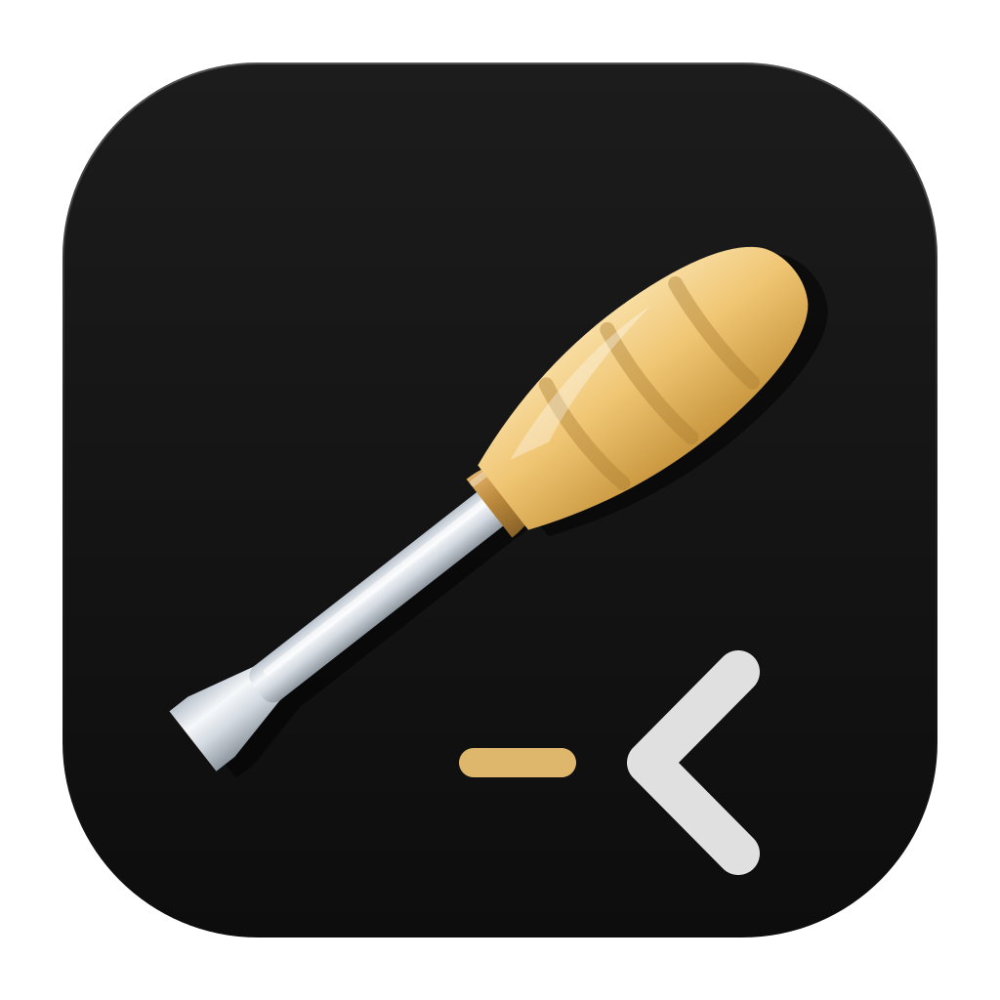

<p align="center">
  
</p>

<h1 align="center">Mind2t</h1>

<p align="center">
  A terminal you can put agents in, on an engine written from scratch in Rust and gated
  against a real reference implementation.
</p>

<p align="center">
  <a href="LICENSE"></a>
  
  
</p>

---

Mind2t runs coding-agent CLIs in real terminal panes, inside git worktrees. The engine
underneath it is not rented: the VT core, the pty and the renderer are all in this repository,
so an agent's state is read from a **typed grid** rather than regexed out of an ANSI byte
stream. A Claude Code CLI has been launched into a pane and its banner, model, working
directory and git branch read straight back off that grid, with no regex and no ANSI parsing
anywhere.

Everything else here exists to make that grid trustworthy.


## Status

Working and in daily use on macOS, Apple Silicon. Pre-1.0, no stability promises, and the
product host is still being ported to parity against the Swift reference host in `swift/`,
which is where some features listed below currently live. Other platforms are not built or
tested yet; the core, frame, render and difftest crates are portable and that work is welcome.

## Why build the engine

Two reasons, and neither is speed. Rust and Zig are peers here and there is no performance win
waiting.

**Agents you can see.** Every comparable tool rents xterm.js or tmux, so agent state arrives
as bytes on a JS thread and has to be parsed back out. Ours arrives as cells.

**Hebrew, done properly.** Reordering, mirrored brackets and GPOS-placed niqqud are not a
plugin here. They are why the renderer is shaped the way it is, and why bidi lives in the
renderer and never in the core, where reordering would break cursor addressing.

## Correctness

The differential harness was written before a single line of terminal logic, and it is the
reason any claim in this README means anything.

At test time the real `libghostty-vt` is built and linked, and `corpus/cases.toml` compares
our grid against its grid case by case. Some cases are pinned to *disagree*, because a harness
that cannot detect disagreement proves nothing. `oracle.lock` pins the exact reference commit,
so a verdict flipping overnight is distinguishable from a regression.

| gate | what it proves |
|---|---|
| `cargo test --workspace` | 688 tests: units, pixels, concurrency, C-surface round trips |
| `ruuah-vt-difftest` | 223 corpus cases, every verdict met, including the 17 pinned to disagree |
| `esctest2` | 391 pinned passes of 568, both directions: a regression fails, so does an unpromoted pass |
| `scripts/smoke-mind2t.sh` | 26 host invariants about what AppKit, WebKit, the IPC and the child processes actually did, with no screen required |
| export check | 14 + 56 C symbols present in the shipped archives |

Plus a headless Swift smoke test and, for anything whose contract ends at the GUI, a live tap
driving synthesized input into a real window.

Every one of those gates has been run against a deliberate mutant and watched go red. A test
that has never been red is not evidence.

## Architecture

Three rules, and they are enforced by crate boundaries rather than by convention.

1. **The core is a pure, deterministic state machine.** Bytes in, grid mutations out. No pty,
   no GPU, no clock, no I/O. That is what makes headless CI and differential testing possible
   at all. I/O lives in exactly one crate and it is not the core.
2. **No terminal bytes in the webview.** Not pixels, not keystrokes, not frames. The chrome
   strip is a browser engine drawing documents. Renting xterm.js would mean running a second
   VT parser in front of ours, which would make every test here measure code nothing calls.
3. **One wgpu surface for all panes.** Pane count is a Rust-side fact. If the webview needs to
   know it, the design is wrong.

## Features

**Terminal core**

- Full VT parsing on a vendored [vte](https://github.com/alacritty/vte) fork (one addition: APC dispatch)
- True color; styled underlines, single / double / curly / dotted / dashed, with SGR 58 underline color
- OSC 8 hyperlinks whose stamps survive scroll and resize; OSC 52 clipboard write; OSC 9 and OSC 777 notifications; bell
- OSC 7 working directory, stored exactly as reported, including two rules the reference implementation's own source gets wrong
- OSC 133 semantic regions (prompt, input, output), the rails everything else rides
- DSR / DA / DECRQM query replies through the pty, so programs that probe get real answers
- Synchronized output (mode 2026) with an anti-stuck budget, so a wedged frame cannot freeze the display
- Bracketed paste (mode 2004) with the reference-measured encoding
- Selection as a query rather than as state: word, line and select-all ranges plus the clipboard text they format to. The word rules are ported from the reference's code, not its doc comment, which is wrong, so `.`, `/`, `-` and `_` are not boundaries and a path, a filename and a flag select whole
- Kitty graphics: direct transmission, RGB / RGBA / PNG, chunked, queries answered, z-ordering, and unicode placeholders where the cells *are* the image, so it scrolls, reflows and erases with the text
- Sixel, decoded into the same image pipeline, and advertised in DA1
- Grapheme clusters from day one; wide glyphs and spacer tails; VS16 emoji presentation
- Paged scrollback with an exact row budget

**Rendering**

- Glyph atlas with damage-driven redraw; a CPU reference backend and a wgpu compute backend, byte-equal to each other by specification
- Color emoji (sbix), synthesized block mosaics, per-glyph font fallback
- Bidi in the renderer: UBA reordering at 91,707 of 91,707 BidiCharacterTest cases, mirrored brackets in RTL runs, niqqud placed by GPOS shaping
- Font ligatures behind a substitution guard, so a non-ligating font renders byte-identically with the feature on or off
- Selection drawn as a tint blended over the finished row rather than as a cell background, which would be erased by the next cell's

**Input**

- Kitty keyboard protocol: the full flag stack, CSI-u encoding, `modifyOtherKeys`, byte-compared against the reference encoder across 135,216 cases with zero divergent
- SGR mouse (1000 / 1002 / 1003 / 1006) plus alternate scroll, against a ~65k-case differential matrix; the wheel routes by mode to report, arrow keys, or viewport
- Chords match physical keys, so a Hebrew layout keeps every one of them

**The product host** (`crates/mind2t`)

- One window opening with one pane, split right with cmd+D, with a real gutter reserved between panes and a rule drawn into it in the same render pass
- Click-drag, double-click and triple-click selection, cmd+A, cmd+C. cmd+C is conditional on purpose: with nothing selected it falls through to the child as `^C` and can still interrupt a command. Shift takes the pointer back from a child that has captured the mouse
- cmd+V bracketed paste, cmd+= / cmd+- / cmd+0 live zoom across every pane, cmd+click hyperlinks
- Agent launcher: ten agent CLIs with the fields that actually differ, a PATH probe that measures availability rather than trusting a table, spawn-observe-retry with counted backoff, and a guard that refuses an auto-approve bypass rather than stripping it
- `~/.mind2t/config.toml`: font size, family, ligatures, shell, themes, auto-direction, and `reports`, which is off by default because it lets a program read back what is on your screen

**The Swift reference host** (`swift/`), the parity target the port is measured against

- Top tab bar with live program titles and work-state dots driven by OSC 9;4 progress, explicit signals only
- Scrollback viewport: wheel and cmd+PageUp / Home / End, pinned to content while a program prints, snapping back the moment you type
- cmd+K command palette with TOML workflows: placeholders discovered from the command text, filled one at a time, and pasted rather than executed
- Autosuggestions, fish-style ghost text keyed by working directory: a command you ran *here* outranks a newer one you ran elsewhere
- OSC 133 blocks with a gutter (copy command, copy output, run again), built to survive prompt-rewriting themes
- Git-worktree workspaces and a WKWebView diff-review panel over the active session's repository

## Building

Requires Rust 1.93 or newer. macOS on Apple Silicon.

```sh
git clone https://github.com/Orellius/mind2t.git
cd mind2t
cargo run -q -p mind2t --bin mind2t     # run it
```

The rest:

```sh
cargo test --workspace                  # the gate: every test green
cargo run -p ruuah-vt-difftest          # the corpus, measured against libghostty-vt
./scripts/smoke-mind2t.sh               # host gate: no window, no synthesized input
./scripts/build-lib.sh                  # libruuah-vt.a       (the drop-in ABI)
./scripts/build-host.sh                 # libruuah-vt-host.a  (ABI plus embedder surface)
./scripts/build-swift.sh                # the Swift reference host and its headless smoke test
./scripts/build-app.sh                  # assemble, sign and install the app
sh scripts/demo-features.sh             # the one-screen feature tour, inside the terminal
```

Running the differential harness additionally needs a Ghostty checkout to build its oracle
from, pointed at by `RUUAH_VT_ORACLE_SRC`. See [CONTRIBUTING.md](CONTRIBUTING.md) for that and
for the rest of the development setup.

## The names

- **Mind2t** is the product: the app in `crates/mind2t`.
- **`ruuah-vt`** is the engine, and it keeps its name. The VT core, pty, renderers and C ABI
  are the part somebody else could embed, so the crates carry the engine's name while the
  repository carries the product's.
- The `-vt` is heritage. The engine started as a drop-in for the C ABI Ghostty publishes as
  `libghostty-vt`, meant to sit behind somebody else's GUI, then grew its own window,
  renderer, panes and agent launcher. The ABI promise is still real and still tested: you can
  link `libruuah-vt.a` where `libghostty-vt` was expected.

## Contributing

Read [CONTRIBUTING.md](CONTRIBUTING.md) first. The short version: extend the harness before
you change behaviour, and a new test must be seen to fail.

Security reports go through a [private advisory](https://github.com/Orellius/mind2t/security/advisories/new),
not a public issue. [SECURITY.md](SECURITY.md) documents what a remote byte stream is and is
not allowed to make this terminal do.

## License

[AGPL-3.0-only](LICENSE). The vendored `crates/vte` fork remains MIT OR Apache-2.0, with both
license texts kept in-tree.

**No Ghostty source is copied into this repository.** Ghostty is the measuring instrument, not
the foundation: it is linked by exactly one crate at test time, and the shipped binary
contains zero of its symbols. [NOTICE](NOTICE) states the position in full, including which
parts of the core's behaviour were derived by reading the reference's source and why that is
derivation rather than transcription.

## Acknowledgments

- [Ghostty](https://ghostty.org) (MIT), the reference implementation this engine is measured against at test time, and the origin of the ABI.
- [vte](https://github.com/alacritty/vte), the parser this project vendors and extends.
- [esctest2](https://github.com/ThomasDickey/esctest2) (GPL-2.0, test time only), the conformance suite run against our own pty.
- [Culmus](https://culmus.sourceforge.io), for Miriam Mono CLM, the only monospace font we found that does Hebrew niqqud correctly.
