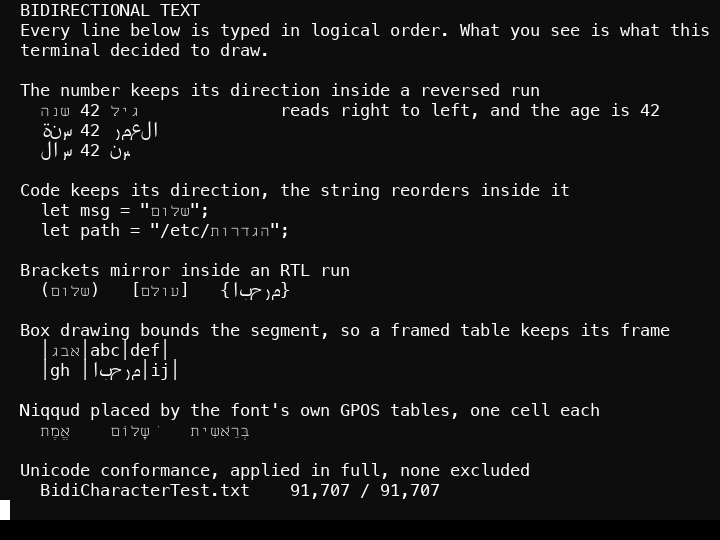
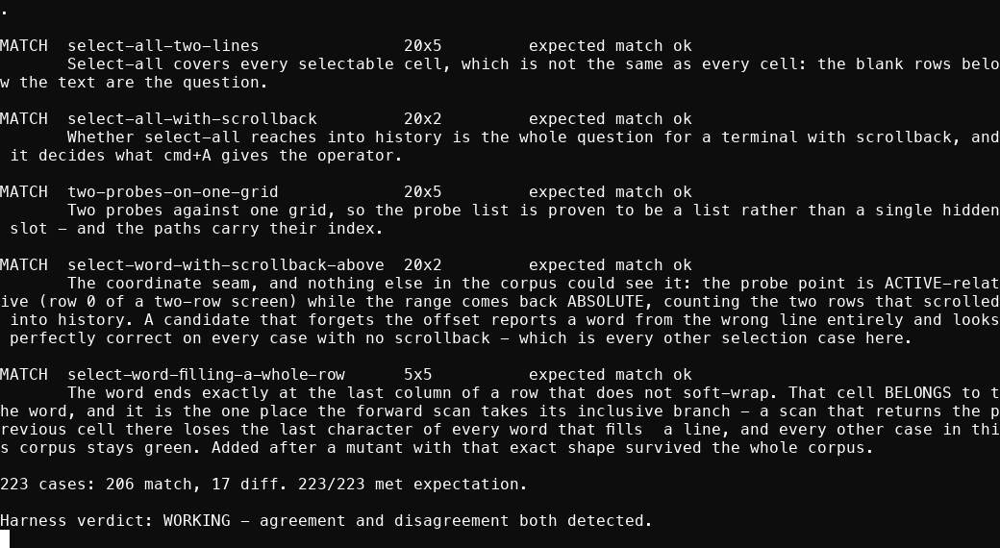
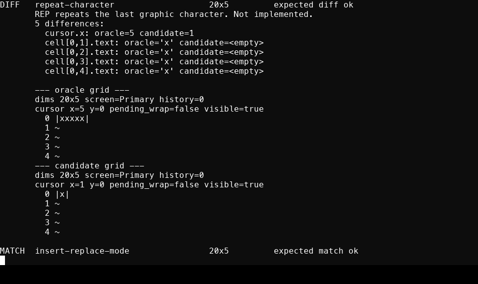
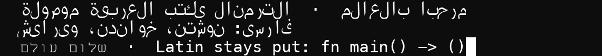
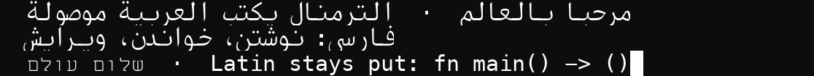

<p align="center">
  
</p>

<h1 align="center">Mind2t</h1>

<p align="center">
  A terminal written from zero in Rust, checked case by case against a real one.
</p>

<p align="center">
  <a href="LICENSE"></a>
  
  
  
</p>



<p align="center"><em>Hebrew, Arabic and Latin on one grid. Rendered by this terminal, not mocked
up: <code>cargo run -p mind2t-vt-render --example screenshot</code>. The number does not flip, the
code keeps its direction, and the box drawing stays in its own columns.<br>
Details and the Unicode conformance numbers: <a href="#bidirectional-text">Bidirectional text</a>.</em></p>

---

## Why this exists

I wanted a terminal that renders Hebrew properly, and there wasn't one.

Not "supports Unicode". Properly: text that reorders right to left without dragging the numbers
backwards with it, brackets that mirror, and niqqud placed where the font's own tables say they
belong rather than wherever the default bearings drop them. Every terminal I tried got some part
of that wrong, and the ones that tried at all did it as a late addition on top of a renderer that
had been built assuming left to right.

That is not something you can patch in. It changes what a row is, so it has to be in the design
from the first commit.

The second reason arrived later and turned out to matter more. I run coding agents, several at
once, and every tool for doing that rents its terminal from `xterm.js` or `tmux`. That means the
agent's state arrives as a stream of escape codes that something has to guess its way back
through with regular expressions. If you own the terminal, you do not guess: the agent's model,
its working directory and its git branch are already sitting in cells, typed, because your own
parser put them there.

So the terminal came first. **The workbench is the goal and it is not built** - there is no session
map, no canvas, nothing that shows you what several agents are doing at once. What exists on top of
the engine today is a window with panes, plus a module that can launch an agent CLI into one. The
richer surface lives in the Swift host, which is a wrapper around the same engine and is where the
tabs, palette, blocks and worktrees actually are. Read the feature list below as two hosts over one
core, not as a product.

## Written from zero

There was a predecessor. It was a fork of [Ghostty](https://ghostty.org), and forking taught me
where the seams were without teaching me why any of it worked. So I archived it and started
again from an empty directory on 2026-07-28.

The parser, the grid, scrollback, reflow, the pty, the renderer, bidi, shaping, the C ABI and
the app are all written for this project. The one piece not written here is the escape-sequence
tokenizer, a vendored fork of [vte](https://github.com/alacritty/vte), kept in-tree with its
licences and one addition of our own.

**No Ghostty code ships here.** The app binary contains zero of its symbols and links zero of
its libraries, which is checkable with `nm` and `otool`.

The history carries no personal data either, and that is checkable rather than asserted. Every
commit is authored by one GitHub noreply identity, no commit message names an account, and the
only address anywhere in the log is the reserved example domain:

```sh
git log --all --format='%an <%ae>' | sort -u                          # one noreply identity
git log --all --format='%b %s' | grep -oiE '[a-z0-9._%+-]+@[a-z0-9.-]+\.[a-z]{2,}' | sort -u
```

Absolute paths do appear, and all of them are synthetic test fixtures such as `/Users/orel/src`,
which exist because OSC 7 reports a `file://` URI and the corpus has to pin what the parser does
with one. Home-relative paths appear too, and they are this program's own: `~/.mind2t/config.toml`
and the `~/.ruuah` fallback it still reads.

The commits were rewritten once, on 2026-08-07, to remove an email address and two paths into a
private machine before the repository was made public. Nothing else moved: the tree hash at HEAD
is byte-identical either side of that rewrite, and all 305 commits and 28 tags survived with
their messages, dates and ordering intact.

## How it is checked, and against what

Ghostty did not disappear from the project. It became the instrument.

The differential harness was written **before a single line of terminal logic**. At test time the
real `libghostty-vt` is built and linked, and a corpus feeds the same bytes to both
implementations and compares the resulting grids, case by case.



<p align="center"><em>The corpus, rendered by the terminal it is testing.</em></p>

Two hundred and six cases agree. **Seventeen are pinned to disagree on purpose**, because a
corpus where nothing ever differs cannot demonstrate that the harness detects difference at all.
The last line of that run is the point: agreement and disagreement are both detected.

A case pinned to disagree is a to-do rather than a failure. When the behaviour gets implemented
the case *fails*, and promoting it to `match` is the evidence the change worked.



<p align="center"><em>A pinned divergence: the reference grid, our grid, and every difference located to the cell.</em></p>

`oracle.lock` records the exact reference commit the verdicts were measured against, so a case
flipping overnight can be told apart from a regression.

### The rule underneath all of it

**A test must be seen to fail.** Every gate here has been run against a deliberately broken
version and watched go red. That is not a slogan; it is what found:

- a retry path matching the wrong errno on Darwin, which had never once executed
- a seqlock whose torn reads carried valid generation numbers, so every cell agreed with every other cell while the frame was wrong
- a Metal command-buffer pool deadlock that only appeared at a real window size
- a selection that outlived the pane it was made in and underflowed the renderer, found by splitting panes in the live window until it died
- every Arabic letter drawn in its isolated form, invisible to a suite whose other scripts have only one form per letter
- a pty shutdown that could deadlock forever, which had been hanging a test for at least a day without ever going red

### A hang is worse than a failure

The last of those is worth its own note, because it is the shape of defect this project is
least protected against. `Host::shutdown` stopped the pty pump before killing the child, and
the pump is the only reader of the pty master; a child exiting with a controlling terminal
blocks in the kernel until its output queue drains, so it could never finish exiting and the
parent waited on it forever. **The reader has to outlive the child.**

Nothing went red. Cargo simply never returned. One instance was found still running seven and
a half hours after it started, holding its child processes, with two more beside it, while
every suite run that looked green ran alongside them.

What named it was a discriminating pair rather than a theory: 120 rounds of spawn-then-shutdown
with a **silent** child pass in 0.74s, and the same loop with a child that prints **one line**
first hangs within 40. A third attempt at a deterministic repro, using a large piped write,
did **not** reproduce, and that was evidence too - the pipeline was slow to start, so the child
was killed before writing anything.

Two consequences, and the second matters more. The kill happens first now, so the pump keeps
draining while the child exits. And the reap is **bounded**: a shutdown that can block forever
is a defect whatever the ordering, because it takes the caller's thread with it. That bound is
also what lets the regression test go **red** instead of hanging, which is the only reason it
counts as a gate at all.

### Tests measure their own claim, not the machine

Two tests here were green locally and red on a shared CI runner, for reasons that had nothing
to do with the code. A synchronized-output test split its batch 60ms apart and was measured
against a 150ms anti-stuck budget - a 2.5x margin, which is no margin at all on a machine
somebody else is using, so the budget correctly published a half-drawn frame and a test about
the gate failed for the wrong reason. A seqlock test required the reader to land at least one
accepted read inside a fixed 400ms window, which a two-core runner cannot promise.

Neither was a real defect and neither was harmless: a gate that reports on how loaded the
machine is teaches you to ignore it. The budget became a per-test setting so the gate test and
the budget test each set the value their own claim needs, and the liveness window now extends
while nothing has been accepted rather than failing. The workload, the race and the invariant
are untouched in both.

| gate | what it proves |
|---|---|
| `cargo test --workspace` | 706 tests: units, pixels, concurrency, C-surface round trips |
| `mind2t-vt-difftest` | 223 corpus cases, every verdict met, 17 of them pinned to disagree |
| `esctest2` | 391 pinned passes of 568, both directions: a regression fails, so does an unpromoted pass |
| `scripts/smoke-mind2t.sh` | 26 host invariants about what AppKit, WebKit, the IPC and the child processes actually did, with no screen required |
| export check | 14 + 56 C symbols present in the shipped archives |

The screenshots above were taken with `cargo run -p mind2t-vt-render --example screenshot`, which
runs a command in a real pty and renders the result with this terminal's own CPU backend. A
picture of some other terminal agreeing with our numbers would not be the claim being made.

## Bidirectional text

This is the feature the renderer was shaped around, and the one thing here that no other
terminal does.

Every line in the image at the top of this file is a rule that a plausible implementation gets
wrong:

- **The number does not flip.** `גיל 42 שנה` becomes `הנש 42 ליג`. An implementation that reverses the run wholesale gives you `24`, and it looks entirely reasonable until somebody reads a port number backwards.
- **Word order reverses, the words do not.**
- **Code keeps its direction** while the string inside it reorders.
- **Brackets mirror** inside an RTL run.
- **Box drawing bounds the segment**, so a framed table keeps its frame where the program drew it. Whole-line reordering across a table moves the frame relative to the text it encloses.
- **Niqqud are placed by the font's own GPOS tables**, one cell each, rather than at default bearings.

### What you type, and what lands on the grid

Logical order is what the program writes; visual order is what the terminal draws. Read the right
column right-to-left where it is Hebrew or Arabic, and note what does **not** move.

| script | logical (what the program writes) | visual (what this terminal draws) |
|---|---|---|
| Hebrew | `שלום עולם` | `םלוע םולש` |
| Hebrew + digits | `גיל 42 שנה` | `הנש 42 ליג` |
| Hebrew in code | `let msg = "שלום";` | `let msg = "םולש";` |
| Hebrew in a frame | `│אבג│abc│` | `│גבא│abc│` |
| Arabic | `مرحبا بالعالم` | joined, right-to-left, each letter in its contextual form |
| Persian | `سلام دنیا` | same, and `پ چ ژ گ` resolve through the same stack |

Three of those are the cases a plausible implementation gets wrong. **`42` stays `42`** - reversing
the run wholesale yields `24`, and it reads as perfectly normal until somebody types a port number
backwards. **The code keeps its direction** while the string inside it reorders. **The box drawing
stays in columns 0, 4 and 8**, because whole-line reordering across a table moves the frame
relative to the text it encloses.

Arabic and Persian go through the same reordering as Hebrew - the algorithm is script agnostic -
and additionally through the shaper, because they are cursive: a contiguous run in one cursive
script is shaped as a run so each letter takes its initial, medial, final or isolated form.

Render any of them yourself. The example runs a command in a real pty and draws the result with
this terminal's own CPU backend, so it needs no window and no display:

```sh
cargo run -p mind2t-vt-render --example screenshot -- \
  --cols 30 --rows 3 --font 32 --out /tmp/shot.bmp --until "42" -- \
  /bin/sh -c "printf 'gil 42 shana\nגיל 42 שנה'"
```

`--until` is the text the example waits to see on the grid before capturing; without it you
photograph an empty screen. The output is a BMP, and it is deliberately not a PNG: writing one
would mean an encoder in the render crate's dependency tree to serve a debugging tool.

### The proof

The oracle is Unicode itself, not an opinion. `crates/frame/tests/bidi_conformance.rs` runs our
own layout against the Unicode Character Database:

| suite | result |
|---|---|
| `BidiCharacterTest.txt` | **91,707 applied, 91,707 passed, 0 excluded** |

Every case in the file is applied; none is skipped by the segment rule. 2,162 of the first 4,000
require real reordering, so the comparison provably distinguishes visual from logical rather than
passing on text that happens to be direction-neutral. The test also refuses a truncated suite, so
a vendoring accident fails loudly instead of quietly measuring less.

`BidiTest.txt` is vendored alongside it by `scripts/fetch-ucd.sh` and is **not yet run**; the
reference-vs-property form it uses needs its own harness. Stated rather than counted, because a
number nothing computes is not evidence.

The suite caught a genuine bug on its first run: the
fast path that skipped the algorithm for plain text ignored the base direction, and under an RTL
base even a row of neutrals resolves to level 1 and reverses.

### Where it lives, and why that is the whole design

**Bidi is in the renderer and never in the core.** Reordering in the core would break cursor
addressing, because a cursor-addressed TUI has no mapping for where its cursor went after a
reorder. It would also make every RTL line diverge from the differential oracle by construction,
deleting the only correctness signal this project has. Slice 5.5 landed reordering with the
corpus untouched at 78/78, which is that separation demonstrated rather than asserted.

### Fonts, and what each script needs

The algorithm is script agnostic. Drawing is a separate question, and it is answered by the font
stack rather than by the reordering.

| script | face | state |
|---|---|---|
| Latin, box drawing, powerline | Menlo | ships with macOS |
| Hebrew | **Miriam Mono CLM** (Culmus, GPL-2.0) | optional, worth installing; monospaced, GSUB composes shin-dot and dagesh, GPOS centres niqqud, marks carry zero advance so a pointed cluster stays one cell |
| Arabic, Persian | **Kawkab Mono** (SIL OFL 1.1) | optional, worth installing; covers both blocks and joins correctly. It does **not** fix the grid - see below |
| Arabic fallback | SF Arabic, Geeza Pro | ship with macOS, so Arabic and Persian render on a bare machine |

Both optional faces are user-installed and the stack drops them silently when absent, so nothing
here demands somebody else's font.

Until 2026-08-07 the stack was `Menlo -> Miriam Mono CLM -> Arial Hebrew`, none of which carries
the Arabic block, so every Arabic and Persian codepoint drew as a **blank cell** while the bidi
algorithm reordered them perfectly. Correct algorithm, empty row, no error anywhere. It was found
by rendering the sheet above across three scripts and looking at it, not by a test, and
`arabic_and_persian_resolve_somewhere_in_the_stack` is that omission turned into one.

Coverage alone was not the fix. Adding a face stopped the blank cells and left Arabic sitting off
the grid, so `a_monospaced_arabic_face_outranks_the_proportional_ones` pins the ordering and
checks that the monospaced face is the one which actually answers rather than merely the one
listed first.

**And that is still not enough, which this file claimed otherwise until 2026-08-08.** Installing a
monospaced Arabic face does not put Arabic on the grid. Measured at 32px against a 19px cell:

| codepoint | face that answers | advance |
|---|---|---|
| `A` | Menlo | 19.27px |
| `א` | Miriam Mono CLM | 19.20px |
| `ب` | **Kawkab Mono** | **22.40px** |

Monospaced is a property of a face on its own - uniform advance within itself. A terminal grid
needs something else entirely: an advance equal to the **primary** face's, and no font ships
promising that. Miriam Mono matching Menlo to 0.07px is luck rather than design, and it is the
whole reason Hebrew has never shown this and Arabic always will. The visible symptom is a letter
overhanging its cell: because a run paints in logical order, on a right-to-left row each letter's
spill lands on a cell already painted and never cleared, so an empty space beside an Arabic letter
keeps 50 inked pixels of its neighbour.

The fix is named rather than guessed at - rasterise each fallback at `size * cell / advance`,
27.1px here, which is uniform scaling so letter shapes survive. Not built. Until it is, the defect
is pinned by `an_arabic_glyph_still_overhangs_its_cell`, which asserts it **as it stands** the way
a corpus case marked `diff` does: when the fix lands that test fails, and the failure is the
feature. Detail in [`docs/BACKLOG-2026.md`](docs/BACKLOG-2026.md) under P2.

**Arabic letters take their contextual forms.** A contiguous run of cells in one cursive script
is shaped as a run, so each letter resolves to its initial, medial, final or isolated glyph, and
every glyph is then positioned in its own cell: shape for form, position for grid. Measured at
32px, beh alone is glyph 867 and the same letter inside a word resolves to 870 / 869 / 868.

Before, every letter drawn in its isolated form:



After, the same bytes through the same renderer, one variable changed:



Both are this terminal's own CPU backend, which is byte-identical to the GPU one by
specification, captured with `cargo run -p mind2t-vt-render --example screenshot` and therefore
needing no window and no display. The Hebrew and the Latin are unchanged between them, which is
the control: a change that moved those would be a change to something other than joining.

Until 2026-08-08 this rendered as isolated forms, and the note here blamed terminal grids. That
was wrong. Shaping was gated on a cluster having more than one codepoint, so a lone Arabic letter
never reached the shaper at all and got the charmap's nominal glyph, which is the isolated form -
a bug in this renderer, not a property every terminal shares. The diagnosis is kept in
[`docs/plans/2026-08-07-arabic-joining.md`](docs/plans/2026-08-07-arabic-joining.md).

Hebrew coverage is pinned across the classes that appear in real text rather than one letter:
base letters, final forms, niqqud, the dagesh GSUB composes into its base, and punctuation.

### What is not done

**The mandatory lam-alef ligature is refused rather than approximated.** Two characters collapse
into one glyph, which does not fit a cell grid, so the run shaper returns nothing and those cells
fall back to the isolated forms drawn before. Wrong in a known way beats overlapping a cell.

**Joining strokes do not always meet**, because each glyph is positioned in its own cell rather
than at the previous glyph's advance. The letters are in their correct joined forms, which is the
part that makes Arabic readable. That is the real grid limit, and it is much smaller than the one
this section used to claim.

**Arabic glyphs overhang their cell**, because the faces that ship with macOS are proportional -
beh advances 22.4px against a 19px cell. Whether the overhang survives depends on paint order, so
in a right-to-left run an empty space beside a letter carries its neighbour's ink: measured
2026-08-08, 50 pixels of it. Recorded in
[`docs/BACKLOG-2026.md`](docs/BACKLOG-2026.md); installing Kawkab Mono avoids it entirely.

## How it compares

Bidi is where the difference is, and it is not close. Sources are each project's own material,
checked 2026-08-07.

| | bidi in the terminal | owns its VT core | checked against a reference |
|---|---|---|---|
| **Mind2t** | **yes**, UBA in the renderer, 91,707 Unicode conformance cases, Hebrew and Arabic scripts drawn | yes | yes, 223 corpus cases |
| kitty | **no**, by its own documentation | yes | no published gate |
| Ghostty | no bidi surface in its C ABI | yes | it *is* the reference here |
| WezTerm, Alacritty, iTerm2 | not claimed by this project; check their docs | yes | no published gate |
| Warp | not claimed by this project | yes | no published gate |
| Agent tools on `xterm.js` or `tmux` | inherits whatever it rents | **no** | no |

[kitty's own documentation](https://sw.kovidgoyal.net/kitty/conf/) states it does not support
bidi, and names the consequence precisely: in the Hebrew word `ירושלים`, selecting the character
that *appears* on screen to be `ם` puts `י` into the selection buffer. Its suggested workaround is
GNU FriBidi outside the terminal, with kitty forced to treat all text as left to right.

That failure is exactly what this project avoids by keeping the logical order in the core and the
visual order in the renderer: selection is answered from the logical model, so the character you
select is the character you get.

The rows marked "not claimed" are honest gaps rather than findings. I measured kitty and Ghostty;
I have not audited the others, and I would rather leave a cell empty than fill it from memory.

## Architecture

Three rules, enforced by crate boundaries rather than by convention.

1. **The core is a pure, deterministic state machine.** Bytes in, grid mutations out. No pty, no GPU, no clock, no I/O. That is what makes headless CI and differential testing possible at all, and I/O lives in exactly one crate which is not the core.
2. **No terminal bytes in the webview.** Not pixels, not keystrokes, not frames. The chrome strip is a browser engine drawing documents. Renting `xterm.js` would mean running a second VT parser in front of ours, which would make every test here measure code nothing calls.
3. **One wgpu surface for all panes.** Pane count is a Rust-side fact. If the webview needs to know it, the design is wrong.

## Features

**Terminal core**

- Full VT parsing on a vendored [vte](https://github.com/alacritty/vte) fork (one addition: APC dispatch)
- True colour; styled underlines, single / double / curly / dotted / dashed, with SGR 58 underline colour
- OSC 8 hyperlinks whose stamps survive scroll and resize; OSC 52 clipboard write; OSC 9 and OSC 777 notifications; bell
- OSC 7 working directory, stored exactly as reported, including two rules the reference implementation's own source gets wrong
- OSC 133 semantic regions (prompt, input, output), the rails everything else rides
- DSR / DA / DECRQM query replies through the pty, so programs that probe get real answers
- Synchronized output (mode 2026) with an anti-stuck budget, so a wedged frame cannot freeze the display
- Bracketed paste (mode 2004) with the reference-measured encoding
- Selection as a query rather than as state: word, line and select-all ranges plus the clipboard text they format to. The word rules are ported from the reference's code, not its doc comment, which is wrong, so `.`, `/`, `-` and `_` are not boundaries and a path, a filename and a flag select whole
- Kitty graphics: direct transmission, RGB / RGBA / PNG, chunked, queries answered, z-ordering, and unicode placeholders where the cells *are* the image, so it scrolls, reflows and erases with the text
- Sixel, decoded into the same image pipeline, and advertised in DA1
- Grapheme clusters from day one; wide glyphs and spacer tails; VS16 emoji presentation
- Paged scrollback with an exact row budget

**Rendering**

- Glyph atlas with damage-driven redraw; a CPU reference backend and a wgpu compute backend, byte-equal to each other by specification
- Colour emoji (sbix), synthesized block mosaics, per-glyph font fallback
- **Bidi in the renderer**: UBA reordering at 91,707 of 91,707 BidiCharacterTest cases, mirrored brackets in RTL runs, niqqud placed by GPOS shaping. In the renderer and never in the core, because reordering there would break cursor addressing
- Font ligatures behind a substitution guard, so a non-ligating font renders byte-identically with the feature on or off
- Selection drawn as a tint blended over the finished row rather than as a cell background, which would be erased by the next cell's

**Input**

- Kitty keyboard protocol: the full flag stack, CSI-u encoding, `modifyOtherKeys`, byte-compared against the reference encoder across 135,216 cases with zero divergent
- SGR mouse (1000 / 1002 / 1003 / 1006) plus alternate scroll, against a ~65k-case differential matrix; the wheel routes by mode to report, arrow keys, or viewport
- Chords match physical keys, so a Hebrew layout keeps every one of them

**The Tauri host** (`crates/mind2t`) - a window with panes. Not a workbench yet: nothing here shows
you several agents at once, which is the whole point of the word and the reason it is not used.

- One window opening with one pane, split right with cmd+D, with a real gutter between panes and a rule drawn into it in the same render pass. Splitting stops before a pane becomes too narrow to use rather than continuing until something breaks
- A pane whose child has exited closes itself and gives its width back to the survivors; the last one closing closes the window
- Click-drag, double-click and triple-click selection, cmd+A, cmd+C. cmd+C is conditional on purpose: with nothing selected it falls through to the child as `^C` and can still interrupt a command. Shift takes the pointer back from a child that has captured the mouse
- cmd+V bracketed paste, cmd+= / cmd+- / cmd+0 live zoom across every pane, cmd+click hyperlinks
- Agent launcher: ten agent CLIs with the fields that actually differ, a PATH probe that measures availability rather than trusting a table, spawn-observe-retry with counted backoff, and a guard that refuses an auto-approve bypass rather than stripping it
- `~/.mind2t/config.toml`: font size, family, ligatures, shell, themes, auto-direction, and `reports`, off by default because it lets a program read back what is on your screen

**The Swift host** (`swift/`) - a wrapper around the same engine, and currently the richer of the
two. It is the parity target the Tauri port is measured against, which is why it is not deleted:
a port with no reference is a rewrite with extra steps.

- Top tab bar with live program titles and work-state dots driven by OSC 9;4 progress
- Scrollback viewport: wheel and cmd+PageUp / Home / End, pinned to content while a program prints, snapping back the moment you type
- cmd+K command palette with TOML workflows: placeholders discovered from the command text, filled one at a time, and pasted rather than executed
- Autosuggestions, fish-style ghost text keyed by working directory
- OSC 133 blocks with a gutter: copy command, copy output, run again
- Git-worktree workspaces and a WKWebView diff-review panel over the active session's repository

## Status

Working as a terminal, and in daily use on macOS, Apple Silicon. Pre-1.0, no stability promises.

**What it is not: a workbench.** There is no session map, no canvas, no way to see what several
agents are doing at once. The Tauri host is a window with panes and an agent launcher; the Swift
host is a wrapper with tabs, a palette, blocks and worktrees. Both sit on one engine, and the
engine is the part that is finished. The surface that would earn the word "workbench" is planned
in `docs/plans/` and not started.

Other platforms are not built or tested; the core, frame, render and difftest crates are portable
and that work is welcome.

## Building

Requires Rust 1.93 or newer.

```sh
git clone https://github.com/Orellius/mind2t.git
cd mind2t
cargo run -q -p mind2t --bin mind2t     # run it
```

The rest:

```sh
cargo test --workspace                  # the gate: every test green
cargo run -p mind2t-vt-difftest          # the corpus, measured against libghostty-vt
./scripts/smoke-mind2t.sh               # host gate: no window, no synthesized input
./scripts/build-lib.sh                  # libmind2t-vt.a       (the drop-in ABI)
./scripts/build-host.sh                 # libmind2t-vt-host.a  (ABI plus embedder surface)
./scripts/build-swift.sh                # the Swift reference host and its headless smoke test
./scripts/build-app.sh                  # assemble, sign and install the app
sh scripts/demo-features.sh             # the one-screen feature tour, inside the terminal
```

Running the differential harness additionally needs a Ghostty checkout to build its oracle from,
pointed at by `MIND2T_VT_ORACLE_SRC`. See [CONTRIBUTING.md](CONTRIBUTING.md) for that and the rest
of the development setup.

## The names

- **Mind2t** is the product: the app in `crates/mind2t`.
- **`mind2t-vt`** is the engine, and it keeps its name. The VT core, pty, renderers and C ABI are
  the part somebody else could embed, so the crates carry the engine's name while the repository
  carries the product's.
- The `-vt` is heritage. The engine started as a drop-in for the C ABI Ghostty publishes as
  `libghostty-vt`, meant to sit behind somebody else's GUI, then grew its own window, renderer,
  panes and agent launcher. The ABI promise is still real and still tested: you can link
  `libmind2t-vt.a` where `libghostty-vt` was expected.

## Contributing

Read [CONTRIBUTING.md](CONTRIBUTING.md) first. The short version: extend the harness before you
change behaviour, and a new test must be seen to fail.

Security reports go through a [private advisory](https://github.com/Orellius/mind2t/security/advisories/new),
not a public issue. [SECURITY.md](SECURITY.md) documents what a remote byte stream is and is not
allowed to make this terminal do.

## License

[AGPL-3.0-only](LICENSE). The vendored `crates/vte` fork remains MIT OR Apache-2.0, with both
licence texts kept in-tree.

Ghostty is the measuring instrument, not the foundation: linked by exactly one crate at test
time, and absent from the shipped binary. [NOTICE](NOTICE) states the position in full, including
which parts of the core's behaviour were derived by reading the reference's source and why that is
derivation rather than transcription.

## Acknowledgments

- [Ghostty](https://ghostty.org) (MIT), the reference implementation this engine is measured against at test time, and the origin of the ABI.
- [vte](https://github.com/alacritty/vte), the tokenizer this project vendors and extends.
- [esctest2](https://github.com/ThomasDickey/esctest2) (GPL-2.0, test time only), the conformance suite run against our own pty.
- [Culmus](https://culmus.sourceforge.io), for Miriam Mono CLM, the only monospace font I found that does Hebrew niqqud correctly.
